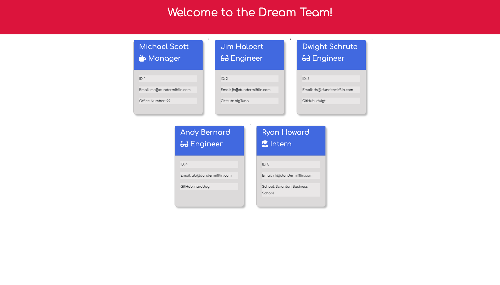
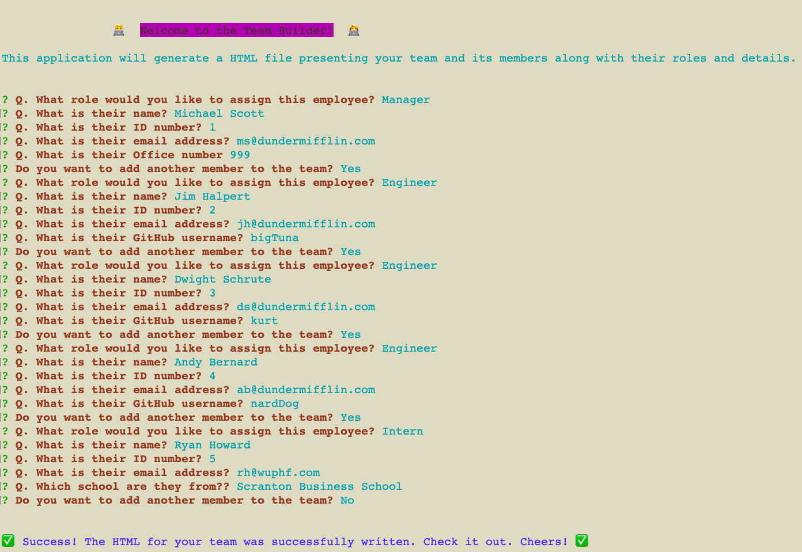

    <h3 align="center">Team Builder</h3>
     
    

    Create a dashboard for your team!
     
     
    <a href="https://github.com/wdfhai/team_builder">View Demo</a>
    

 

    
Table of Contents

    <ol>
        <li><a href="#about-the-project">Description</a></li>
        <li><a href="#built-with">Built With</a></li></li>
        <li><a href="#installation">Installation</a></li>
        <li><a href="#usage">Usage</a></li>
        <li><a href="#contributing">Contributing</a></li>
        <li><a href="#license">License</a></li>
        <li><a href="#contact">Contact</a></li>
        <li><a href="#summary">Summary</a></li>
    </ol>

### Description

A CLI designed to accept input from the user regarding their team and then generate an HTML with the teammembers' information in an easily glanceable format.

### Built With

Following languages, frameworks and libraries were used in the development of this project:

- HTML,CSS,JavaScript
- Bootstrap,NodeJS

### Installation

Yes, this application requires Node, NPM, Inquirer, Chalk and node-emoji installed.

### Usage

Have the following information ready to go: names, IDs, emails, roles, office numbers (for managers), github usernames (for engineers) and school name (for interns).

### Contributing

Contributions are what make the open source community such an amazing place to learn, inspire, and create. Any contributions you make are **greatly appreciated**.

1. Fork the Project
2. Create your Feature Branch
3. Commit your Changes
4. Push to the Branch
5. Open a Pull Request

### License

This project is using the following license: MIT

### Contact

You can reach me for any questions or comments at the following:

- Look me up on Github, where my username is <a href="https://github.com/wdfhai">wdfhai</a>.
- Reach out to me through email at wd.fhai@outlook.com.
- Find me on Twitter at https://twitter.com/wdfhai.

### Summary

Thank you for checking out my Team Builder CLI. I hope you enjoyed my work. Cheers!
